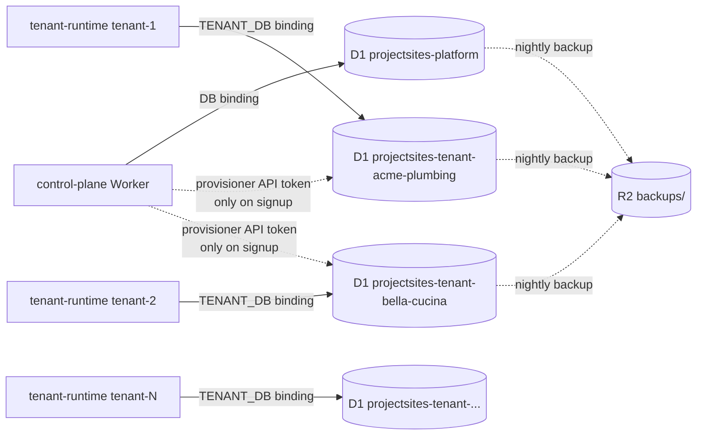
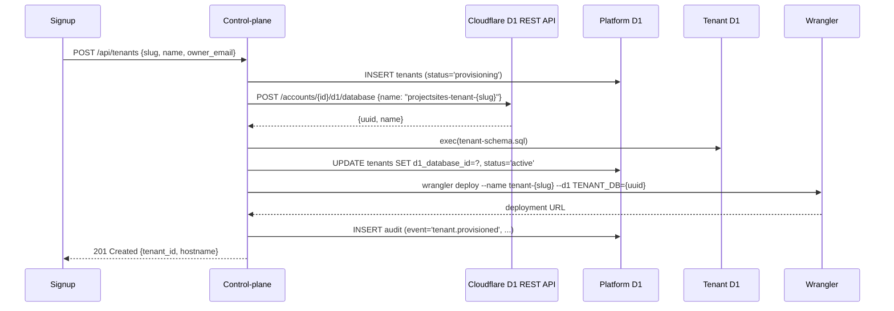
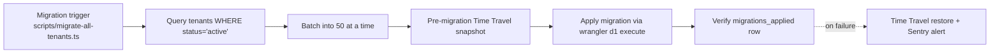
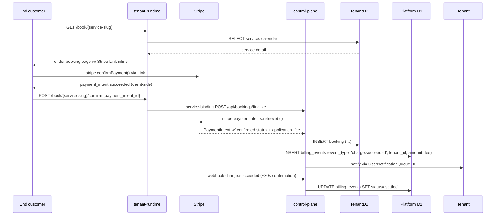
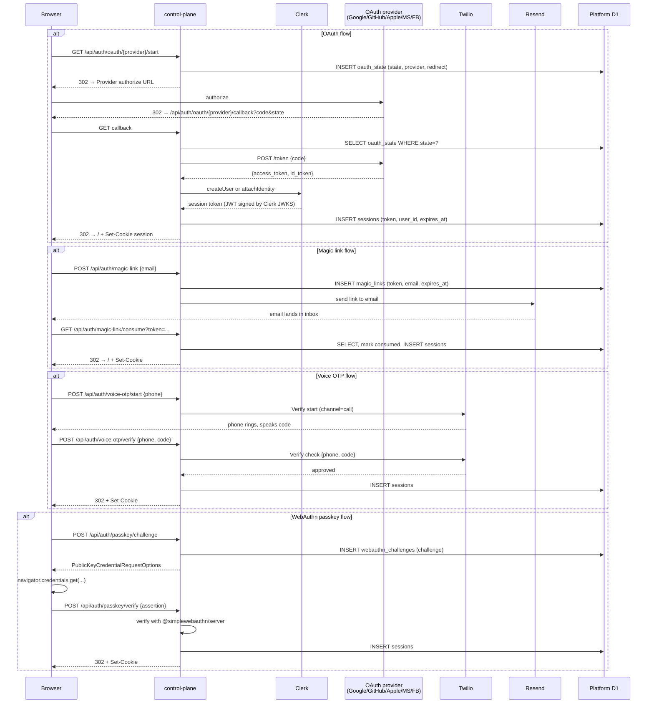
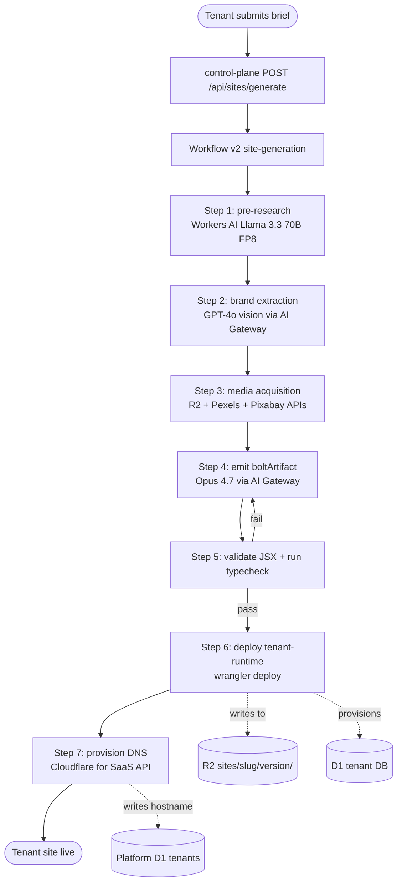
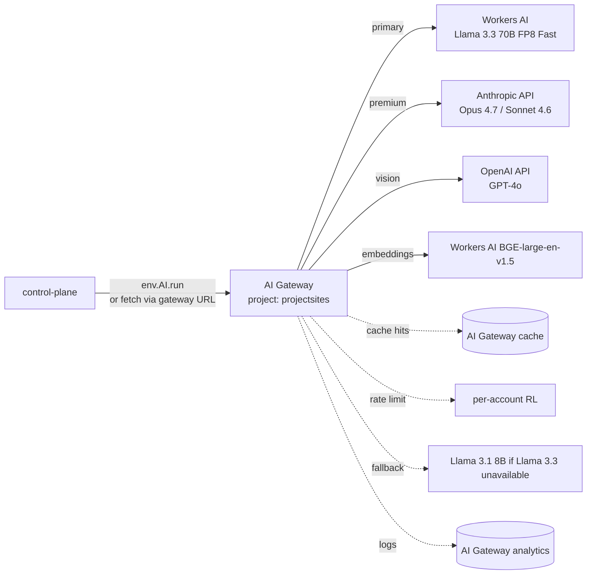
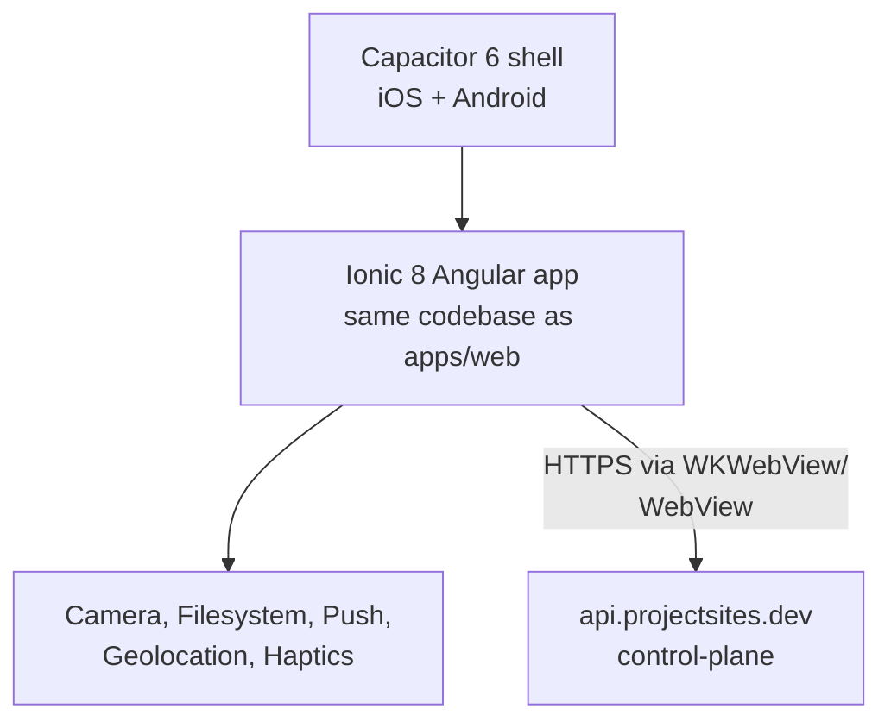
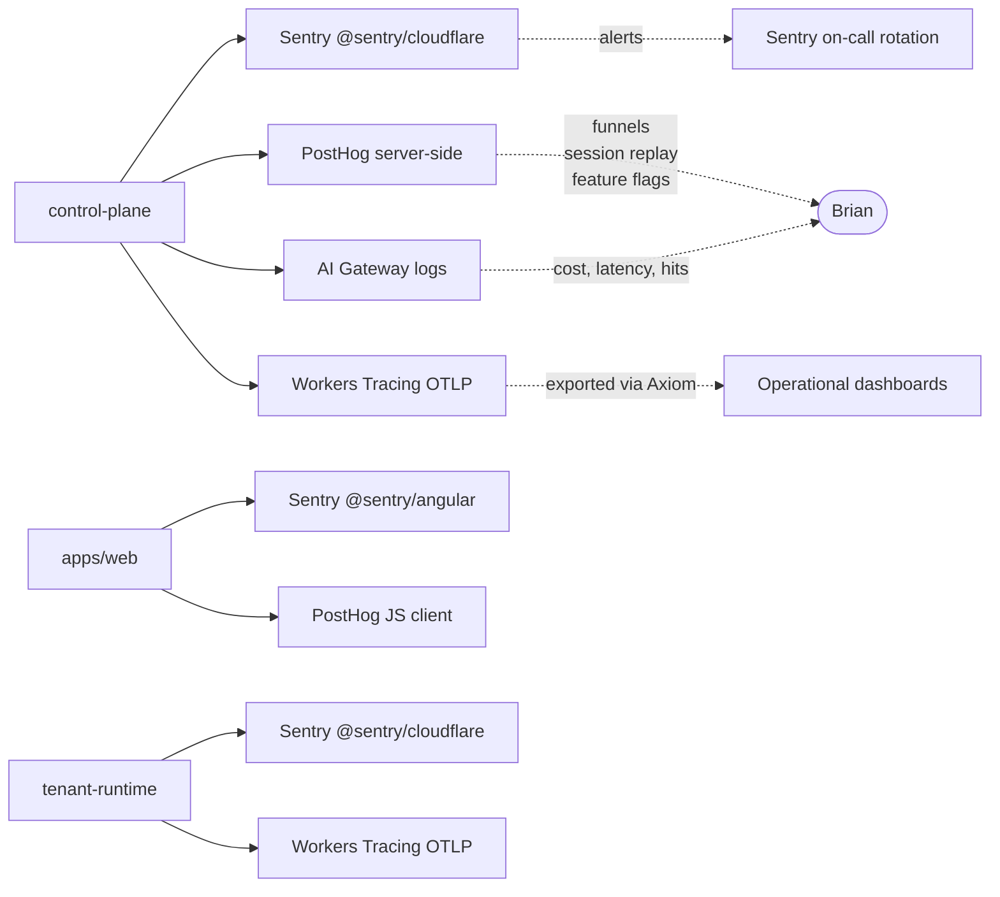

# ARCHITECTURE.md — projectsites.dev v2

> **Owner:** Architect. Co-signed by Brian Zalewski.
> **Status:** Authoritative topology for v2. Reflects all eight accepted ADRs in
> [DECISIONS.md](./DECISIONS.md). Last reviewed: 2026-05-26.
> **Audience:** Engineers wiring service bindings, ops reading runbooks, sub-agents
> establishing context for a new feature.

This document is the **system topology of record**. Every Worker, every binding, every
Durable Object class, every D1 database, every R2 prefix, every queue, every webhook
target is named here. If a component exists in production but is not on this page, it is
either undocumented (file a PR) or it should not exist (file an issue).

---

## 1. System overview

```mermaid
flowchart TB
  user([End user / browser])
  tenant([Tenant admin / SPA])
  mobile([Mobile app])

  subgraph Edge[Cloudflare Edge]
    web[apps/web<br/>Angular 21 SSR Worker]
    cp[apps/control-plane<br/>Hono API Worker]
    tr[apps/tenant-runtime<br/>Hono Worker per tenant]
    kv[(KV: host resolution<br/>flags, prompt overrides)]
    r2[(R2: sites/, marketing/,<br/>documents/, backups/)]
  end

  subgraph Data[Cloudflare D1]
    d1p[(D1 platform<br/>tenants, users, subs,<br/>billing_events, audit)]
    d1t1[(D1 tenant 1<br/>pages, bookings, leads)]
    d1t2[(D1 tenant 2<br/>pages, bookings, leads)]
    d1tN[(D1 tenant N ...)]
  end

  subgraph Durable[Cloudflare Durable Objects]
    do_log[SiteLogStream]
    do_chat[JobChatRoom]
    do_track[JobTrackingHub]
    do_notify[UserNotificationQueue]
    do_rate[TenantRateLimit]
  end

  subgraph AI[AI inference]
    ai_workers[Workers AI<br/>Llama 3.3 70B FP8 Fast]
    ai_gw[AI Gateway<br/>routing+cache+rate-limit]
    ai_anthropic[Anthropic API<br/>Opus 4.7 / Sonnet 4.6]
    ai_openai[OpenAI API<br/>GPT-4o / vision]
  end

  subgraph External
    stripe[Stripe Link<br/>Connect Express<br/>Billing meters]
    resend[Resend SMTP]
    clerk[Clerk Auth<br/>OAuth+passkey+TOTP]
    twilio[Twilio Verify<br/>voice OTP+SMS]
    cfsaas[Cloudflare for SaaS<br/>custom hostnames]
  end

  user -->|projectsites.dev<br/>tenant.projectsites.dev<br/>custom.tenant.com| web
  tenant -->|app.projectsites.dev| web
  mobile -->|api.projectsites.dev| cp

  web -->|service binding| cp
  web -->|render generated sites| tr

  cp --> d1p
  cp --> kv
  cp --> r2
  cp --> do_log
  cp --> do_chat
  cp --> do_track
  cp --> do_notify
  cp --> do_rate
  cp --> ai_gw
  ai_gw --> ai_workers
  ai_gw --> ai_anthropic
  ai_gw --> ai_openai
  cp --> stripe
  cp --> resend
  cp --> clerk
  cp --> twilio

  tr --> d1t1
  tr --> d1t2
  tr --> d1tN
  tr --> r2

  cfsaas -.->|SNI fallback origin| web
```



**Read this diagram top-to-bottom:**

- **Top:** the three traffic origins (end users on tenant sites, admins on the SaaS
  control plane, mobile app).
- **Middle (edge):** every component runs on a Cloudflare Worker. There are exactly
  three Worker apps in v2 — `apps/web`, `apps/control-plane`, `apps/tenant-runtime` —
  plus per-tenant deployments of `tenant-runtime`.
- **Data tier:** **one platform D1** + **N tenant D1s** (one per tenant site, per
  [ADR-0008](./DECISIONS.md#adr-0008--one-d1-database-per-tenant-site-auto-provisioned)).
- **Stateful middle layer:** Durable Objects for per-entity bursty state (log streams,
  job chat rooms, location tracking, notifications, rate limits).
- **AI:** all LLM traffic flows through AI Gateway — never direct.
- **External SaaS:** Stripe, Resend, Clerk, Twilio, Cloudflare for SaaS. Each has a
  single integration point.

---

## 2. The three Worker apps

| App | Path | Routes | D1 bindings | Other bindings |
| --- | ---- | ------ | ----------- | -------------- |
| `apps/web` | Angular 21 SSR | `projectsites.dev/*`, `tenant.projectsites.dev/*`, `app.projectsites.dev/*` | (none — service-binds to control-plane) | service-binding `CONTROL_PLANE`, KV `HOST_CACHE`, R2 `R2_MARKETING` |
| `apps/control-plane` | Hono API | `api.projectsites.dev/*`, `webhooks.projectsites.dev/*` | `DB` (platform D1) | Durable Objects (5 classes), KV, R2, AI Gateway, all external SaaS keys |
| `apps/tenant-runtime` | Hono Worker, one deploy per tenant | `{slug}.projectsites.dev/*`, `{custom-domain}/*` | `TENANT_DB` (per-tenant D1) | R2 `R2_SITES` (read-only at prefix `sites/{slug}/{version}/`) |

### 2.1 `apps/web` — Angular SSR Worker

- **Purpose:** Server-side render the marketing site, the admin SPA, the tenant
  preview surface. Hydrates client-side via Angular's incremental hydration
  ([BACKLOG.md #3](./BACKLOG.md)).
- **Runtime:** Cloudflare Workers with the `@angular/ssr` adapter compiled to a single
  Worker bundle.
- **Routing:** TanStack Router (per [ADR-0002](./DECISIONS.md#adr-0002--angular-21--standalone--signals--zoneless))
  drives client-side; server-side route matching uses Angular's `provideRouter` with the
  same route table.
- **Calls control-plane via service binding** — never via `fetch('https://...')`. The
  service binding lets the SSR Worker call the API with a `Request` object directly,
  avoiding TLS handshake + cold start.
- **No direct DB binding.** SSR Workers must never read D1 — that responsibility lives
  in the control-plane (separation of concerns + simpler isolation model).

### 2.2 `apps/control-plane` — Hono API Worker

- **Purpose:** the system of record. Every mutation, every external API call, every
  webhook lands here.
- **Framework:** Hono v4 with `@hono/zod-validator` on every route.
- **Routes (grouped):**
  - `/api/auth/*` — OAuth start/callback, magic link, passkey challenge, TOTP verify
  - `/api/sites/*` — CRUD on tenant sites, generate, publish, archive
  - `/api/bookings/*` — marketplace booking lifecycle
  - `/api/billing/*` — subscription state, invoice list, payout history
  - `/api/team/*` — invite, role assignment, permission audit
  - `/api/jobs/*` — operational jobs (workflow runs, scheduled tasks)
  - `/api/logs/*` — per-site log retrieval (SSE stream + paginated history)
  - `/api/snapshots/*` — D1 Time Travel + R2 backup access
  - `/api/sql/*` — admin SQL console (Brian-only super-admin gated)
  - `/api/integrations/*` — third-party connectors
  - `/api/ai/*` — chat, generation, embedding
  - `/api/me` — current-user introspection (role, capabilities, feature flags)
  - `/webhooks/stripe` — Stripe webhook handler
  - `/webhooks/clerk` — Clerk user-update events
  - `/webhooks/resend` — bounce + complaint events
  - `/webhooks/twilio` — voice-OTP verification callback
- **Bindings:**
  - `DB` → platform D1
  - `TENANT_DB_PROVISIONER` → Cloudflare D1 REST API token (scoped: D1 Edit)
  - `KV_HOST_CACHE` → host-to-tenant slug lookup (60s TTL)
  - `KV_FLAGS` → feature flag snapshots
  - `KV_PROMPT_OVERRIDES` → AI prompt hot-patch (5min TTL)
  - `R2_PLATFORM` → `marketing/`, `documents/`, `backups/`
  - 5 Durable Object class bindings (see § 3)
  - `AI` → Workers AI binding (auto-routes through AI Gateway per
    [ADR-0005](./DECISIONS.md#adr-0005--cloudflare-native-runtime-workers--d1--r2--do))
  - Secrets: every Stripe/Clerk/Resend/Twilio/Anthropic/OpenAI/Sentry key
- **Error envelope:** Problem Details (RFC 7807) per the user-level rule.
- **Observability:** Workers Tracing OTLP, Sentry via `@sentry/cloudflare`, PostHog
  server-side capture, AI Gateway logs.

### 2.3 `apps/tenant-runtime` — per-tenant Worker template

- **Purpose:** serve the generated tenant site. Reads tenant-specific content from the
  tenant's own D1 + static assets from R2 at `sites/{slug}/{version}/`.
- **Deployment model:** one Worker per tenant slug, deployed via `wrangler deploy`
  invoked by the control-plane on tenant signup. Each deployment has its own service
  worker name (`tenant-{slug}`) and its own D1 binding (`TENANT_DB` → that tenant's D1).
- **Hostname mapping:** Workers Routes match `{slug}.projectsites.dev/*`. For custom
  domains, Cloudflare for SaaS routes inbound traffic to the same Worker via SNI.
- **Why a Worker per tenant** (not a shared Worker with a `tenant_id` lookup): per
  [ADR-0008](./DECISIONS.md#adr-0008--one-d1-database-per-tenant-site-auto-provisioned),
  binding-per-deploy is the hardware-level isolation primitive. A bug in one tenant's
  Worker cannot reference another tenant's D1.
- **Cold-start budget:** ~5ms for a warm region, ~30ms cold. Acceptable.

---

## 3. Durable Object placement strategy

Five DO classes, each scoped to the smallest natural entity to keep instances bounded.

| DO class | Instance key | Lifecycle | Storage | Purpose |
| -------- | ------------ | --------- | ------- | ------- |
| `SiteLogStream` | `{tenantId}:{siteId}` | Long-lived (until tenant deletes site) | SQLite ring buffer 1000 lines | Streams worker build/runtime logs to the admin via SSE |
| `JobChatRoom` | `{tenantId}:{bookingId}` | Lives for the duration of the booking + 30 days | SQLite messages table | Tenant ↔ end-customer chat about a booking |
| `JobTrackingHub` | `{tenantId}:{bookingId}` | Live during the booking, archived to D1 on completion | SQLite recent location updates | Crew location stream to end-user (marketplace) |
| `UserNotificationQueue` | `{userId}` | Per-user, lifetime of account | SQLite pending notifications | Server push: "your domain is verified", "payment received" |
| `TenantRateLimit` | `{tenantId}:{endpoint-class}` | Rolling 60-second windows | SQLite counters | Per-tenant API rate limiting beyond Cloudflare's global |

### 3.1 Why these five (and not more)

| Pattern | Where it lives |
| ------- | -------------- |
| Per-tenant *settings* | D1 platform table — small, infrequent reads, no concurrency contention |
| Per-tenant *content* | Tenant D1 — same reasoning |
| Per-booking *state machine* | D1 tenant table — bookings are slow-changing |
| Per-job *live chat* | `JobChatRoom` DO — bursty, ordered, multi-subscriber |
| Per-site *log buffer* | `SiteLogStream` DO — bursty, ordered, fanout |
| Per-user *push queue* | `UserNotificationQueue` DO — bursty, ordered, single-subscriber-per-device |
| Per-tenant *rate window* | `TenantRateLimit` DO — atomic increment, time-bucketed |
| Per-job *location stream* | `JobTrackingHub` DO — sub-second updates during a booking |

DOs are reserved for cases where ordering, low-latency atomic state, or fanout to many
subscribers is the deciding factor. Most state lives in D1 because D1 reads cost less,
have read replicas, and the workload is read-heavy.

### 3.2 Sample DO sketch — `SiteLogStream`

```ts
// apps/control-plane/src/durable_objects/site-log-stream.ts
import { DurableObject } from 'cloudflare:workers';

export class SiteLogStream extends DurableObject<Env> {
  private sockets = new Set<WebSocket>();

  async fetch(req: Request): Promise<Response> {
    const url = new URL(req.url);
    if (url.pathname === '/append') {
      const { level, msg, ts } = await req.json<LogLine>();
      this.ctx.storage.sql.exec(
        `INSERT INTO log_lines (ts, level, msg) VALUES (?, ?, ?)`,
        ts, level, msg,
      );
      // Drop oldest if > 1000
      this.ctx.storage.sql.exec(
        `DELETE FROM log_lines WHERE id NOT IN (SELECT id FROM log_lines ORDER BY id DESC LIMIT 1000)`,
      );
      // Fan out to live subscribers
      const line = `event: log\ndata: ${JSON.stringify({ level, msg, ts })}\n\n`;
      for (const ws of this.sockets) ws.send(line);
      return new Response(null, { status: 204 });
    }
    if (url.pathname === '/stream') {
      const [client, server] = Object.values(new WebSocketPair());
      server.accept();
      this.sockets.add(server);
      server.addEventListener('close', () => this.sockets.delete(server));
      return new Response(null, { status: 101, webSocket: client });
    }
    return new Response('not found', { status: 404 });
  }
}
```

The DO is SQLite-backed (per [ADR-0005](./DECISIONS.md#adr-0005--cloudflare-native-runtime-workers--d1--r2--do)),
ring-buffered at 1000 lines, and fanout-via-WebSocket. SSE clients connect via
EventSource through the control-plane, which proxies through this DO.

---

## 4. Data plane — D1 boundaries



### 4.1 Platform D1 (`projectsites-platform`)

Owns global system state. Tables (current count: 123 per AUDIT.md §3):

- `tenants` — slug, name, status, stripe_account_id, d1_database_id, primary_hostname,
  created_at, deleted_at
- `users` — id, email, name, password_hash (legacy), webauthn_credential, totp_secret,
  created_at
- `sessions` — token, user_id, expires_at, ip, user_agent
- `subscriptions` — tenant_id, stripe_subscription_id, tier, status,
  current_period_end
- `billing_events` — full audit log of every Stripe event (see [BILLING.md § 9](./BILLING.md#9-the-billing_events-audit-log))
- `audit` — append-only journal of every privileged action
- `feature_flags` — id, key, rollout, target_rules JSON
- `oauth_state` — short-lived OAuth dance state (30-min TTL)
- `magic_links` — short-lived magic-link tokens (15-min TTL)
- `voice_otps` — short-lived voice/SMS OTP state (10-min TTL)
- `webauthn_challenges` — short-lived passkey challenges (5-min TTL)
- `team_invites` — pending team invitations
- `team_members` — tenant_id, user_id, role, permissions JSON
- `waitlist_geographic` — collected when geo-ineligible visitor signs up
- ... 100+ more

### 4.2 Per-tenant D1 (`projectsites-tenant-{slug}`)

Owns tenant-specific operational data. Provisioned on signup via the D1 REST API. Tables
seeded by `tenant-schema.sql`:

- `pages` — tenant site page content, blocks, metadata
- `blog_posts` — per-tenant blog
- `products` — per-tenant catalog (if e-commerce enabled)
- `services` — per-tenant marketplace listings
- `bookings` — every marketplace booking with full lifecycle state
- `leads` — form submissions, contact requests
- `submissions` — generic form responses
- `analytics_events` — per-tenant aggregated analytics (5-min rollups)
- `tenant_config` — feature toggles specific to this tenant
- `migrations_applied` — schema version tracking (idempotency gate)

### 4.3 Provisioning a new tenant D1



**Idempotency:** all steps are retry-safe. If the D1 already exists, skip create. If the
Worker is already deployed, the deploy is a no-op.

### 4.4 Schema migrations across all tenant DBs

A new column on `bookings` (e.g., adding `cancellation_reason TEXT`) requires running the
migration against every tenant DB. The flow:



---

## 5. Payment flow



The flow appears in both code paths:

1. **Synchronous** — tenant-runtime → control-plane during booking confirmation. Used
   for the customer-facing success page.
2. **Asynchronous** — Stripe webhook → control-plane. Used for idempotent state
   reconciliation. The webhook is the source of truth; the synchronous path is the UX
   accelerator.

See [BILLING.md § 10](./BILLING.md#10-webhook-handler-sketch) for the webhook handler
sketch and idempotency invariants.

---

## 6. Auth flow



All four flows converge on the same `sessions` table. The session cookie is `httpOnly`,
`Secure`, `SameSite=Lax`, with a 30-day expiry and rotation on every privilege change.

The `/api/me` endpoint reads the session, joins to `users` + `team_members` + the active
tenant's roles, and returns:

```json
{
  "user": { "id": "u_...", "email": "...", "name": "..." },
  "tenant": { "id": "t_...", "slug": "...", "name": "..." },
  "role": "owner",
  "permissions": ["billing.read", "billing.write", "sites.write", ...],
  "viewing_as": "owner",
  "is_super_admin": false,
  "feature_flags": { "ai_chat_v2": true, ... }
}
```

The Angular admin SPA reads this on bootstrap and caches it as a signal via
`toSignal(this.api.me$, { initialValue: null })`.

---

## 7. Generator flow — AI site generation

This is the marquee flow. End-to-end:



### 7.1 Workflow v2 step semantics

Each step is deterministic, idempotent, and re-runnable. The control-plane never
implements the steps directly — it only enqueues the workflow and tails its progress via
SSE.

```ts
// apps/control-plane/src/workflows/site-generation.ts
import { WorkflowEntrypoint, WorkflowStep, WorkflowEvent } from 'cloudflare:workers';

interface Params { tenantId: string; brief: BriefInput; }

export class SiteGenerationWorkflow extends WorkflowEntrypoint<Env, Params> {
  async run(event: WorkflowEvent<Params>, step: WorkflowStep): Promise<void> {
    const { tenantId, brief } = event.payload;

    const research = await step.do('research', { retries: { limit: 3 } }, async () => {
      return this.env.AI.run('@cf/meta/llama-3.3-70b-instruct-fp8-fast', {
        messages: [{ role: 'user', content: researchPrompt(brief) }],
      });
    });

    const brand = await step.do('brand-extract', { retries: { limit: 2 } }, async () => {
      return callGPT4oVision(this.env, brief.referenceSite);
    });

    const assets = await step.do('media', async () => {
      return acquireMedia(this.env, brief.industry, research);
    });

    const artifact = await step.do('generate-artifact', async () => {
      return callOpus47(this.env, { brief, research, brand, assets });
    });

    await step.do('validate', async () => {
      return validateArtifact(artifact);
    });

    const deploymentId = await step.do('deploy', async () => {
      return deployTenantRuntime(this.env, tenantId, artifact);
    });

    await step.do('dns', async () => {
      return provisionCustomHostname(this.env, tenantId);
    });

    await step.do('notify', async () => {
      return notifyTenant(this.env, tenantId, deploymentId);
    });
  }
}
```

### 7.2 Why Workflow v2 (not Inngest, not Queue+poll)

- Step-based execution with native retry + backoff
- Pause/resume across days (waitForEvent)
- Deterministic replay
- Native Cloudflare binding — no auth tokens between services
- 50K concurrent instance ceiling fits v1 comfortably
- Saga compensation patterns implementable as explicit step.do blocks
  (e.g., if `deploy` succeeds but `dns` fails, the next step is `rollback-deploy`)

---

## 8. Service binding topology

Service bindings replace HTTP between Workers. Three bindings exist in v2:

| Caller | Binding name | Callee | Purpose |
| ------ | ------------ | ------ | ------- |
| `apps/web` | `CONTROL_PLANE` | `apps/control-plane` | SSR-time data fetching |
| `apps/tenant-runtime` | `CONTROL_PLANE` | `apps/control-plane` | Booking finalization, lead capture |
| `apps/control-plane` | `TENANT_RUNTIME` | `apps/tenant-runtime` (any tenant) | Cache purge after publish |

Service bindings transit through the Cloudflare control plane in ~1ms and bypass TLS
handshake. They do *not* count against the caller's outbound request quota.

`wrangler.jsonc` excerpt:

```jsonc
{
  "name": "projectsites-web",
  "main": "src/main.server.ts",
  "compatibility_date": "2026-05-26",
  "services": [
    { "binding": "CONTROL_PLANE", "service": "projectsites-control-plane", "entrypoint": "default" }
  ],
  "kv_namespaces": [{ "binding": "HOST_CACHE", "id": "..." }],
  "r2_buckets": [{ "binding": "R2_MARKETING", "bucket_name": "project-sites-production" }]
}
```

---

## 9. R2 prefix layout

| Prefix | Owner | Content | Lifecycle |
| ------ | ----- | ------- | --------- |
| `marketing/` | `apps/web` (deploy) | Angular SSR static assets, marketing pages | Replaced on every deploy |
| `sites/{slug}/{version}/` | `apps/control-plane` (generator) | Generated tenant site bundle (HTML/JS/CSS/images) | Versioned; old versions retained 90 days |
| `documents/{tenant}/` | `apps/control-plane` (export jobs) | Tenant-generated PDFs, invoices, statements | 7-year retention (tax) |
| `backups/{date}/{tenant}.sql.gz` | Workflow (nightly) | D1 → R2 dumps | 90-day retention then archived |
| `customer-runtime/` | `apps/tenant-runtime` (deploy) | Runtime JS loaded by generated customer sites | Replaced on customer-runtime release |
| `archives/billing-events/{year}.jsonl.gz` | Workflow (annual) | Old billing_events past 7y | Cold storage indefinite |

R2 lifecycle rules:

- `sites/*/v*` — Standard → Infrequent Access after 30 days
- `backups/*` — Standard → Infrequent Access after 7 days, delete at 90 days
- `documents/*` — Standard for active year, Infrequent Access thereafter

---

## 10. AI Gateway routing

Every LLM call goes through Cloudflare AI Gateway. No direct vendor calls from any
Worker. Configuration:



Routing rules:

- First-pass content generation → Workers AI Llama 3.3 70B FP8 Fast (free)
- Architectural decisions, top-tier copy polish, vision QA → Opus 4.7
- Bulk implementation → Sonnet 4.6
- Formatting/changelog → Haiku 4.5
- Embeddings → BGE-large-en-v1.5
- Vision (brand extraction, image describe) → GPT-4o

---

## 11. Mobile topology



The mobile app is the Angular `apps/mobile` workspace, wrapped in Capacitor 6 for
native iOS + Android shells. It calls the same `control-plane` API as the web app —
no separate mobile backend.

Deep-link routes (`https://projectsites.dev/site/{slug}` → installed app) are deferred
to BACKLOG.md #46.

---

## 12. Hostname routing

```mermaid
flowchart LR
  user([HTTP request]) --> cf{Cloudflare<br/>SNI router}

  cf -->|projectsites.dev<br/>app.projectsites.dev| web[apps/web]
  cf -->|api.projectsites.dev| cp[apps/control-plane]
  cf -->|webhooks.projectsites.dev| cp
  cf -->|{slug}.projectsites.dev| trMatch{Workers Route<br/>tenant-* match}
  cf -->|customer.com<br/>Cloudflare for SaaS| trCustom{Workers Route<br/>tenant-* match}

  trMatch --> tr[apps/tenant-runtime<br/>tenant-{slug}]
  trCustom --> tr
  web -.->|service-binding| cp
```

Resolution order:

1. SNI handshake → Cloudflare edge picks the zone (projectsites.dev OR a customer
   hostname configured via Cloudflare for SaaS)
2. Workers Routes pattern-match the hostname + path against the deployment table
3. Tenant subdomain `{slug}.projectsites.dev` and customer custom hostnames both
   route to the same per-tenant Worker name (`tenant-{slug}`)
4. KV lookup `HOST_CACHE` accelerates the host-to-slug resolution (60s TTL)

---

## 13. Backup + recovery

| Asset | Mechanism | RPO | RTO | Where |
| ----- | --------- | --- | --- | ----- |
| Platform D1 | D1 Time Travel (30-day PIT) + nightly R2 dump | 24h (R2), 1min (TT) | 5min | `wrangler d1 time-travel restore` |
| Tenant D1 (each) | D1 Time Travel (30-day PIT) + nightly R2 dump | 24h (R2), 1min (TT) | 5min per tenant | Same |
| R2 marketing | git (deploy from CI) | N/A | 10min | `nx deploy web` |
| R2 sites/{slug}/{version} | Versioned in path; deploy retains 90 days | 0 (immutable) | 1min | Wrangler re-deploy from prior version |
| R2 backups/ | Self-referential | N/A | N/A | The backups themselves |
| Workers source | git + Nx Cloud cache | 0 | 5min | `nx affected:build` redeploy |
| Secrets | chezmoi (encrypted at rest) + wrangler secret store | 0 | 2min | `wrangler secret put` from chezmoi |

Quarterly restore drill: pick a random tenant, restore to a `-restored` namespace,
diff content against live, then drop the namespace.

---

## 14. Observability topology



- **Errors:** Sentry (per [auto-meta-work] tier 1 — solo SaaS uses PostHog + Sentry +
  Workers Tracing).
- **Product analytics + flags + replay:** PostHog (project 210890 on `Megabyte Labs` org).
- **I/O spans:** Workers Tracing OTLP → Axiom (cheap at edge volumes).
- **LLM observability:** AI Gateway native logs + cache + rate-limit metrics.

---

## 15. Future evolution

This document evolves whenever an ADR materially changes the topology. The expected
near-term changes:

- **Hyperdrive in front of Neon** if/when a tenant analytics workload exceeds D1's
  capacity — at that point Neon becomes a parallel data tier with Hyperdrive as the
  pooler ([BACKLOG.md #19](./BACKLOG.md))
- **Multi-region D1 read replicas** when tenants in EU/APAC show measurable
  cross-Atlantic read latency
- **Tauri 2 desktop shells** as a third client target alongside `apps/web` and
  `apps/mobile` ([BACKLOG.md #45](./BACKLOG.md))
- **Square Web Payments fallback** if a strategic geo breaks Connect ([BACKLOG.md #10](./BACKLOG.md))

When any of these land, file a new ADR, then update the relevant section of this file
in the same PR.

---

## 16. Cross-links

- [DECISIONS.md](./DECISIONS.md) — every architectural commitment
- [BILLING.md](./BILLING.md) — payment topology details
- [SECURITY.md](./SECURITY.md) — threat model + control list (shipped vs deferred)
- [BACKLOG.md](./BACKLOG.md) — queued work post-v1
- [AUDIT.md](./AUDIT.md) — Phase 0 findings (tables, routes, design tokens)
- [PHASE1_SCAFFOLD_PLAN.md](./PHASE1_SCAFFOLD_PLAN.md) — Nx scaffold + merge plan
- [apps/project-sites/CLAUDE.md](./apps/project-sites/CLAUDE.md) — current production worker docs
